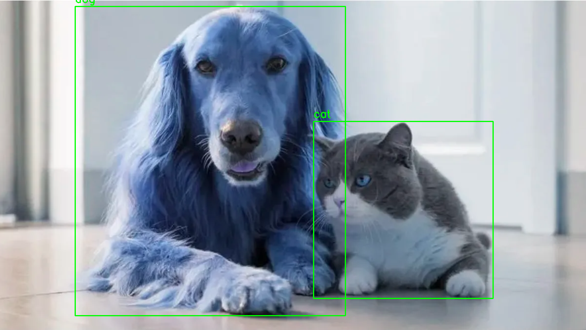
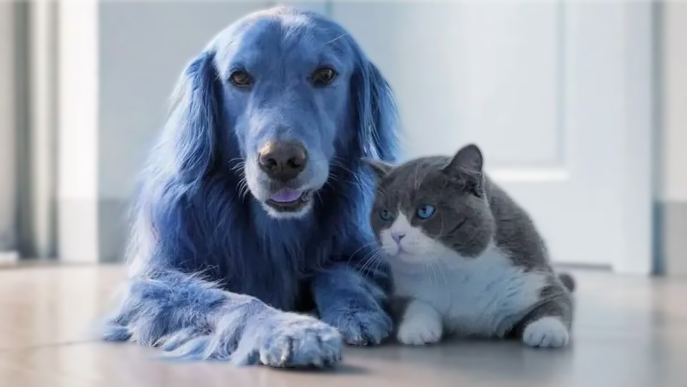
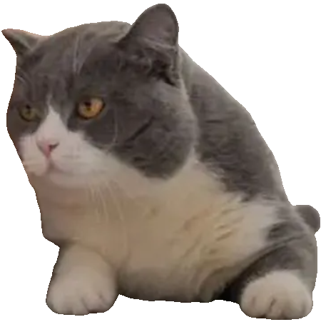
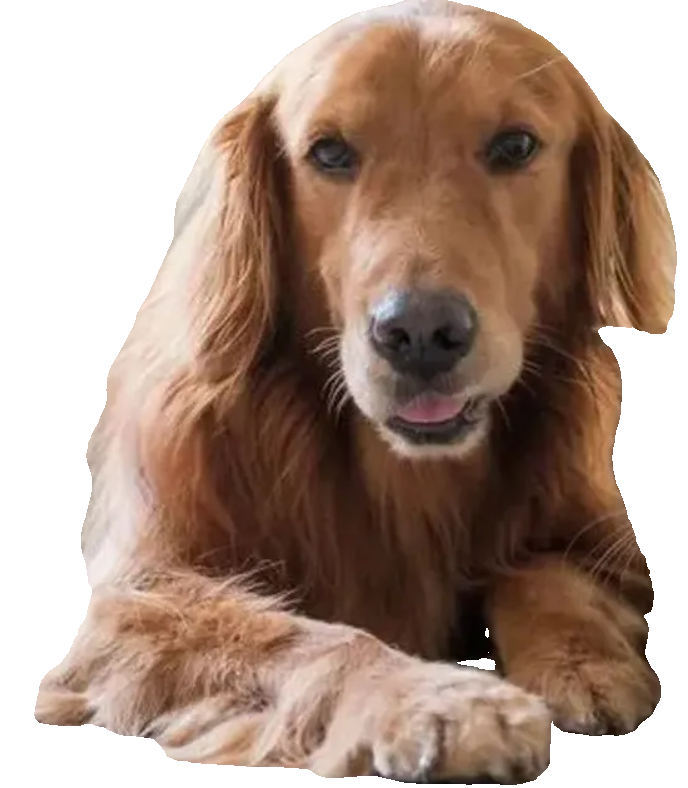
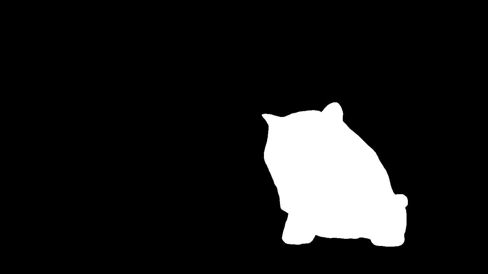
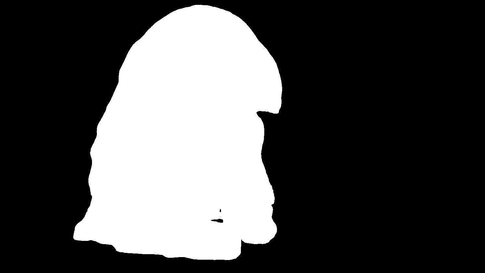

# 🧪 Taller Práctico 4 – Detección y Segmentación con YOLO + SAM

 📅 Fecha - 2025-06-28 - Fecha de finalización

### 🎯 Objetivo del Taller
Integrar los modelos de detección de objetos (YOLO) y segmentación (SAM) para crear una herramienta capaz de detectar, segmentar y analizar regiones específicas en imágenes.
Se debe construir un pipeline visual que:

* Detecta objetos en una imagen (YOLO).
* Segmenta con precisión la forma del objeto detectado (SAM).
* Aplica transformaciones, filtros o estadísticas a las regiones segmentadas.

### 🧠 Conceptos Aprendidos
Los principales conceptos aplicados en este taller fueron:

- Detección de objetos con YOLOv8 (modelo preentrenado `yolov8n.pt`)
- Segmentación de instancias usando SAM con cajas delimitadoras como prompts
- Manipulación de imágenes con OpenCV (dibujo de cajas, máscaras, recortes)
- Análisis visual: cálculo de áreas, perímetros, centroides y conteo de objetos por clase
- Visualización de resultados con Matplotlib (cajas, máscaras, fondo pixelado)
- Generación de recortes y máscaras individuales para cada objeto
- Aplicación creativa: pixelado del fondo con Gaussian Blur

### 🔧 Herramientas y Entorno

  - `Ultralytics (YOLOv8)` para detección de objetos
  - `Segment Anything (SAM)` para segmentación de instancias
  - `OpenCV` para manipulación de imágenes
  - `Matplotlib` para visualización
  - `NumPy` y `Pandas` para análisis de datos
- **Entorno:** Google Colab (CPU/GPU)


### 📁 Estructura del Proyecto
```
2025-06-14_taller_yolo_sam/
├── yolo__sam__pipeline.ipynb
├── images/
│   └── prueba2Animales.png
├── outputs/
│   ├── analisis.json
│   ├── resultados.png
│   ├── recortes/
│   │   ├── dog_<uuid>.png
│   │   ├── cat_<uuid>.png
│   ├── segmentaciones/
│   │   ├── mask_dog_<uuid>.png
│   │   ├── mask_cat_<uuid>.png
│   ├── pixelado_fondo.png
└── README.md
```
### 📖 Implementación - Paso a paso de la práctica

1)  **Instalación de Dependencias**

Se instalaron las librerías `ultralytics` para YOLOv8 y `segment-anything` desde su repositorio de GitHub, junto con el modelo preentrenado SAM (`sam_vit_h_4b8939.pth`). Se crearon los directorios (`images`,`outputs/recortes`, `outputs/segmentaciones`) para almacenar la imagen de prueba y los resultados .

```
!pip install ultralytics -q
!pip install git+https://github.com/facebookresearch/segment-anything.git -q

# Descarga del modelo SAM
!wget https://dl.fbaipublicfiles.com/segment_anything/sam_vit_h_4b8939.pth -O /content/sam_vit_h_4b8939.pth
```


2)   **Detección de Objetos con YOLO**
  
Se utilizó YOLOv8 (`yolov8n.pt`) para detectar objetos en la imagen `prueba2Animales.png`. La función `detectar_objetos_yolo` retorna las coordenadas de las cajas delimitadoras (`xyxy`), las clases detectadas (`dog`, `cat`) y la imagen original, filtrando con un umbral de confianza de 0.5.
```
# Función 1: Detección de objetos con YOLO
def detectar_objetos_yolo(imagen_path):
    """
    Detecta objetos en una imagen usando YOLOv8.
    Retorna las coordenadas de las cajas delimitadoras, las clases y la imagen cargada.
    """
    model = YOLO('yolov8n.pt')
    results = model(imagen_path)

    boxes = []
    classes = []
    imagen = results[0].orig_img if results else cv2.imread(imagen_path)
    if not imagen is None:
        for result in results:
            for box in result.boxes:
                x_min, y_min, x_max, y_max = box.xyxy[0].cpu().numpy().astype(int)
                cls = result.names[int(box.cls)]
                if cls in ['dog', 'cat'] and float(box.conf[0]) > 0.5:
                    boxes.append([x_min, y_min, x_max, y_max])
                    classes.append(cls)
    else:
        raise ValueError("No se pudo cargar la imagen.")
    return boxes, classes, imagen
```
3)  **Segmentación con SAM**
   
El modelo SAM (`vit_h`) se configuró con `SamPredictor` para segmentar las regiones correspondientes a las cajas de YOLO. La función `segmentar_con_sam` genera máscaras binarias precisas para cada objeto detectado.

```
# Función 2: Segmentación con SAM
def segmentar_con_sam(imagen, boxes):
    """
    Segmenta objetos usando SAM con las cajas de YOLO como prompts.
    Retorna una lista de máscaras.
    """
    sam = sam_model_registry["vit_h"](checkpoint="sam_vit_h_4b8939.pth")
    predictor = SamPredictor(sam)
    predictor.set_image(imagen)

    masks = []
    for box in boxes:
        input_box = np.array(box)
        mask, _, _ = predictor.predict(
            box=input_box[None, :],
            multimask_output=False
        )
        masks.append(mask[0].astype(np.uint8))
    return masks
```

5) **Visualización de Resultados**
   
La función `visualizar_deteccion_segmentacion` muestra la imagen con:

- Cajas delimitadoras y etiquetas de clase superpuestas.
- Máscaras segmentadas con color cian semitransparente.
- Recortes individuales de cada objeto y máscaras binarias.

```
# Función 3: Visualización de resultados
def visualizar_deteccion_segmentacion(imagen, boxes, masks, classes):
    """
    Visualiza la imagen original con cajas y máscaras, y guarda recortes.
    """
    img_with_boxes = imagen.copy()
    img_with_masks = imagen.copy()

    for i, (box, mask, cls) in enumerate(zip(boxes, masks, classes)):
        x_min, y_min, x_max, y_max = box
        cv2.rectangle(img_with_boxes, (x_min, y_min), (x_max, y_max), (0, 255, 0), 2)
        cv2.putText(img_with_boxes, cls, (x_min, y_min - 10), cv2.FONT_HERSHEY_SIMPLEX, 0.9, (0, 255, 0), 2)

        mask_color = np.zeros_like(imagen)
        mask_color[mask > 0] = [0, 255, 255]  # Color cian
        img_with_masks = cv2.addWeighted(img_with_masks, 1, mask_color, 0.5, 0)

        # Recorte con fondo blanco
        mask_3ch = np.stack([mask] * 3, axis=-1)
        cropped = np.where(mask_3ch, imagen, 255)
        cropped = cropped[y_min:y_max, x_min:x_max]
        cv2.imwrite(f'outputs/recortes/{cls}_{str(uuid4())[:8]}.png', cropped)

        # Guardar máscara individual
        cv2.imwrite(f'outputs/segmentaciones/mask_{cls}_{str(uuid4())[:8]}.png', mask * 255)
```

6) **Bonus creativo -> Pixelado del Fondo**

La función `analizar_segmentaciones` aplica un desenfoque Gaussian (kernel 21x21) al fondo, preservando las regiones segmentadas (la imagen ya tenia un poco desenfocado el fondo, sin embargo al aplicar el efecto se nota el cambio). Calcula métricas como área en píxeles, porcentaje del área total, perímetro y centroides para cada objeto.

```
    img_pixelated = cv2.GaussianBlur(imagen, (21, 21), 0)
    combined_mask = np.zeros_like(imagen[:, :, 0], dtype=bool)
```

###  📊 Resultados Visuales

**Cajas Delimitadoras y Máscaras**




**Fondo Pixelado**




**Recortes individuales**




**Máscaras binarias**





**Métricas**


### 🧩 Prompts Utilizados
- "Estoy recibiendo un error en SamPredictor al usar box prompts. ¿Cómo configurar correctamente las entradas para segmentar con SAM?"
- "¿Cómo aplicar un filtro de desenfoque solo al fondo de una imagen,sin afectar las regiones segmentadas?"
- "Quiero calcular el área de cada máscara segmentada y guardarla en un JSON. ¿Cómo hacerlo con NumPy y Pandas?"

### 💬 Reflexiones

Este taller me permitió combinar YOLOv8 y SAM para construir un pipeline robusto de detección y segmentación, logrando identificar y aislar con éxito un perro y un gato en prueba2Animales.png gracias a la integración de YOLO para la localización y SAM para la segmentación precisa, mientras que el análisis creativo del pixelado del fondo y las métricas calculadas como área, perímetro y centroides enriquecieron significativamente la utilidad del pipeline. Sin embargo, enfrenté desafíos como configurar SAM con SamPredictor y ajustar las cajas de YOLO, lo que requirió una revisión cuidadosa de la documentación, además de gestionar las máscaras binarias para el pixelado del fondo, una tarea inicialmente compleja para preservar las regiones segmentadas, y noté que el tiempo de procesamiento en Colab fue notable debido al modelo SAM (vit_h), sugiriendo la necesidad de optimizaciones futuras. 

Entre las lecciones aprendidas, destaco que la combinación de modelos preentrenados facilita resolver tareas complejas eficientemente, que la visualización de resultados es clave para validar el rendimiento y que las métricas cuantitativas aportan valor práctico, abriendo oportunidades de mejora como procesar videos en tiempo real, incorporar GroundingDINO para segmentación basada en texto, optimizar con modelos más ligeros como vit_b o cuantización, y explorar efectos adicionales como cambios de color en regiones segmentadas o integración con Gradio.

## ✅ Checklist de Entrega

- [x] Carpeta `2025-06-14\_taller\_yolo\_sam`
- [x] Código limpio y funcional
- [x] GIF incluido con nombre descriptivo (si el taller lo requiere)
- [x] Visualizaciones o métricas exportadas
- [x] README completo y claro
